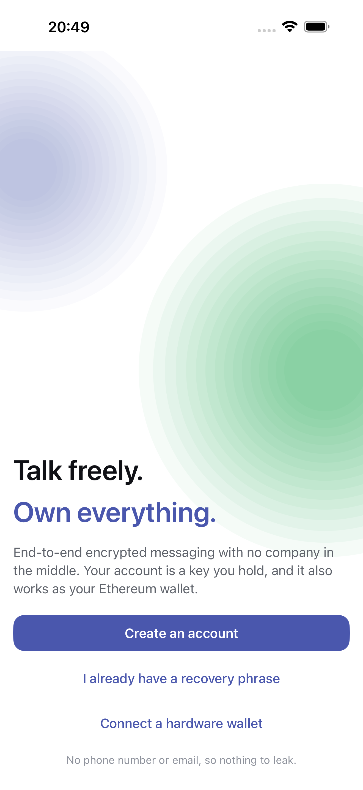
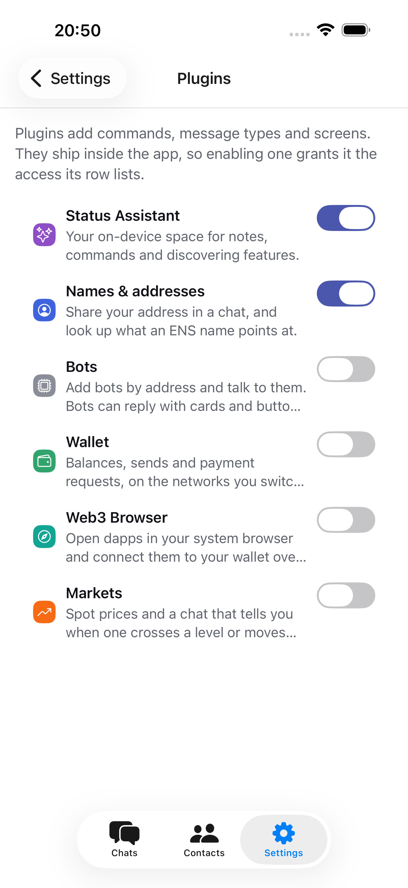

# Status Original

An encrypted messenger whose account is a key you hold. Twelve words, generated
on the device. No sign-up, no phone number, no email, and no backend of ours for
anyone to subpoena, sell or breach. The same phrase is also an Ethereum, Bitcoin
and Solana wallet.

iOS, Android and macOS, from one Expo SDK 57 / React Native 0.86 / React 19.2
codebase. The desktop app is the web export of that codebase running in a Tauri
window.

<p align="center">
  
  
  
  
</p>

**[User guide](https://alaibe.github.io/status-original/)** ·
[Contributing](CONTRIBUTING.md) · [Security](SECURITY.md) ·
[Privacy](PRIVACY.md) · [Disclaimer](DISCLAIMER.md)

## Five networks, one inbox

Every conversation says which network it is on and what that network actually
protects, because the honest answers differ:

| Network | Confidentiality | Reach someone by | Runs on |
| --- | --- | --- | --- |
| **XMTP** | MLS, forward secret | Ethereum address or ENS name | Your recovery phrase |
| **Nostr** | NIP-17 sealed DMs; relays never learn the sender | `npub…` public key | Your recovery phrase |
| **Waku** | Encrypted payloads through an nwaku node you name | Public key | Your recovery phrase |
| **Telegram** | None. Telegram holds and can read it | `@username`, `t.me` link, phone number | Your Telegram account, over TDLib |
| **Matrix** | Olm/Megolm in rooms with encryption on | `@user:server` | Your Matrix account, over matrix-rust-sdk |

Telegram and Matrix are real client implementations, not bridges we operate:
sign in with your own credentials and those chats land in the same list. A
Matrix homeserver running a [mautrix](https://github.com/mautrix) bridge brings
WhatsApp, Signal, Slack, iMessage or Discord along with it, with no code for
any of them in this app.

## What else is in it

- Message requests, folders, search, replies, reactions, forwarding, pin,
  archive and mute. Photos, files, GIFs and voice notes. Groups where the
  protocol has them.
- Links unfurl into cards fetched by your device, not a server. Phone numbers,
  email addresses, map coordinates, wallet addresses and ENS names are tappable
  with no request at all.
- Per-account SQLCipher history. Several accounts per device, each from a
  recovery phrase or a hardware wallet (Ledger, Trezor, Keystone), with optional
  biometric unlock and key protection.
- A fresh install is a messenger and nothing else. Wallet, dapp browser, market
  alerts, bots and name lookups are plugins that ship switched off, each
  declaring its permissions before you enable it.

Everything a plugin does is a slash command. `/` in any conversation opens a
picker scoped to that room; the chips above the composer run the same commands.
`/networks` switches chains on and off, `/send` and `/request` move money inside
the conversation where it came up, `/trade` (also `/swap`, `/bridge`) quotes
through LI.FI, `/scan` reads a WalletConnect code. Anything that signs shows a
review step first.

## Platforms

iOS, macOS, Windows and Linux. Android builds from the same codebase but has no
Telegram: `react-native-tdlib`'s Android side does not expose the raw
`td_json_client` calls `src/protocols/telegram/td-client.ts` drives.

One tag releases every platform. [`distribution/`](distribution/README.md) has the pipeline,
the secrets it reads and the store checklists.

## Quick start

Node.js 22.13+, Xcode 26.3 with an iPhone simulator, and CocoaPods. Rust as
well for the desktop app. Expo Go cannot run this: XMTP, TDLib, SQLCipher and
the hardware wallet transports are all native modules.

```bash
npm install          # also applies patches/ and copies the XMTP wasm bundle
./scripts/setup.sh   # checks the toolchain; --install fixes what it safely can
npx expo run:ios
```

```bash
npm start            # Metro
npm run desktop      # Metro on 8082 plus a Tauri window that reloads on save
npm run typecheck && npm run lint && npm test
npm run test:e2e     # Maestro, against a booted simulator with Metro running
npm run test:all     # all four, in that order
```

`scripts/setup.sh` is a doctor, not an installer: it reports what is missing and
the command that fixes it, and only installs when you pass `--install`. Add
`--android` to include that toolchain in the check.

### Keys and configuration

Nothing secret ships in the repository, and the app works without any of it.

| What | Where | Needed for |
| --- | --- | --- |
| WalletConnect project id | `expo.extra.walletConnectProjectId` in `app.json` | connecting dapps |
| Telegram API id and hash | Settings → Protocols → Telegram, per account | Telegram sign-in ([my.telegram.org](https://my.telegram.org)) |
| Matrix homeserver and ID | Settings → Protocols → Matrix, per account | Matrix sign-in |
| LI.FI key | Settings → Trades, per account | optional; raises the quote rate limit |
| KLIPY key | Settings → GIFs, per account | GIF search |

Token balances need no key at all. `src/lib/evm/token-list.json` is the Uniswap
Labs Default list trimmed to the five chains the wallet sends on (829 entries),
read with one multicall against the endpoint already in use; `/tokens add
<contract>` covers anything it misses. Solana enumerates its own holdings
through `getTokenAccountsByOwner`, with Jupiter's verified list bundled only to
put a name to a mint. `npm run tokens:build` and `npm run tokens:build:solana`
refresh them.

## Documentation

| For | Where |
| --- | --- |
| Using the app | [alaibe.github.io/status-original](https://alaibe.github.io/status-original/) (`docs/`) |
| Working on the code | [`CONTRIBUTING.md`](CONTRIBUTING.md) |
| Reporting a vulnerability | [`SECURITY.md`](SECURITY.md) |
| What leaves your device | [`PRIVACY.md`](PRIVACY.md) |
| What the developer is not responsible for | [`DISCLAIMER.md`](DISCLAIMER.md) |
| Releasing, and what the stores ask for | [`distribution/`](distribution/README.md) |
| Why each dependency is patched | [`patches/README.md`](patches/README.md) |
| End-to-end tests | [`e2e/README.md`](e2e/README.md) |
| Running Nostr and Waku locally | [`local-net/README.md`](local-net/README.md) |
| Writing a bot | [`examples/echo-bot/`](examples/echo-bot/README.md) |

## License

MIT. See [`LICENSE`](LICENSE).
