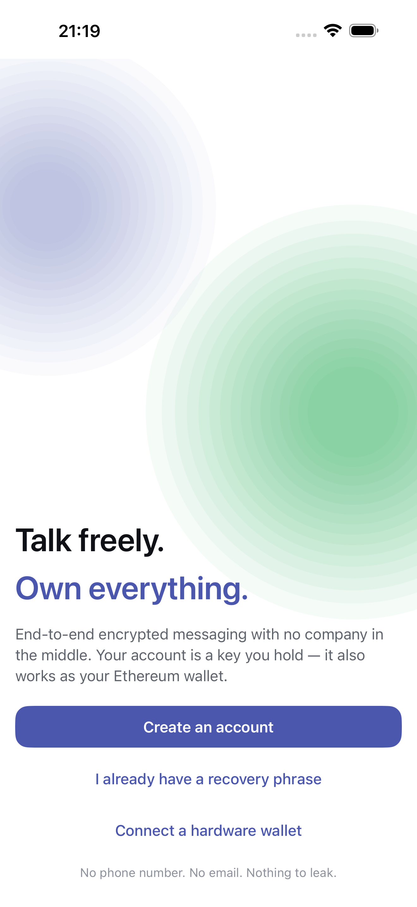
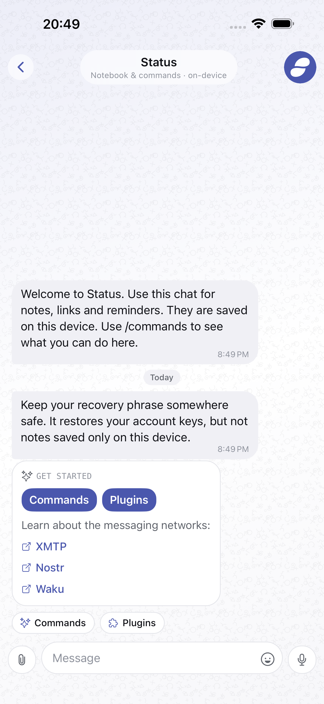

# Status Original

A self-custodial messenger for iOS, Android and the desktop. Your account is a
recovery phrase held on the device. There is no email, phone number or
application backend, and nobody can reset the account for you.

Built with Expo SDK 57, React Native 0.86 and React 19.2; the desktop app is
the same code as a web export inside a Tauri window.

<p align="center">
  
  
  
  
</p>

## What it does

- End-to-end encrypted messaging over XMTP, Nostr and Waku, in one inbox
  that shows which network each conversation is on.
- Message requests, search, filters, replies, reactions, forwarding, photos,
  files, GIFs and voice messages. XMTP groups where the protocol supports
  them.
- Local encrypted history in a SQLCipher database per account.
- Several accounts per device, from a phrase or a hardware wallet (Ledger,
  Trezor, Keystone), with optional biometric unlock.
- Plugins that ship in the binary and switch on per account: a wallet for
  Ethereum, Bitcoin and Solana, price alerts, profile tools, local bot rooms,
  and a browser plugin with bookmarks that connects sites in the system
  browser back to the wallet over WalletConnect (Uniswap, CoW Swap, 1inch,
  Matcha, SushiSwap, Curve).

The app has three tabs: Chats, Contacts and Settings. The local Status room
holds help and plugin commands. In any chat, `/` opens a command picker and
`/commands` lists what works in that room; the chips above the composer run
the same commands.

Some commands worth knowing: `/networks` turns chains on and off and picks the
default, `/send` and `/request` start on that default unless you pass
`--chain`, `/scan` reads a WalletConnect code, and `/open matcha` opens a
bookmark. Sending shows a review step first and signs nothing until you confirm.

## Architecture

```text
src/
  app/          Expo Router routes and tab navigation
  core/
    app/        account runtime and application lifecycle
    identity/   accounts, keyrings, hardware signers, key protection
    messaging/  chat domain, persistence sessions, history, projections
    commands/   command parsing and shared group commands
    plugins/    plugin contracts, registry, storage and host
  protocols/    XMTP, Nostr and Waku descriptors and adapters
  storage/      account-scoped storage, SQLCipher, vault, media, erase
  design/       tokens, components, motion and widget rendering
  features/     chat and protocol UI
  plugins/      the bundled plugins
  desktop/      what the web build swaps in for the desktop window
src-tauri/      the desktop window: Rust commands for SQLCipher, the vault and Ledger
```

A file ending in `.web.tsx` or `.web.ts` is the desktop version of its
neighbour; `docs/desktop.md` lists them.

`ChatSession` is the messaging contract the app talks to. XMTP implements it
on the SDK's own encrypted database; Nostr and Waku use `StoreBackedSession`
over the app's `MessageStore`, so transport code stays separate from local
persistence. `AccountRuntime` owns the active account's storage, plugins,
protocol sessions and local bots. Conversation and message IDs carry their
protocol before they reach the unified store.

A plugin contributes commands, content types, bots, URI handlers, composer
actions and overlays. A content type declares its codec and its renderer
together, so a client that lacks the plugin shows the payload's fallback text.

Account data is split by medium: recovery phrases, database keys and
credentials in SecureStore; conversations and messages in one SQLCipher
database per account; preferences in account-scoped AsyncStorage; downloaded
media in account-scoped directories. Erasing an account removes all of it
before the keys.

## Setup

Node.js 22.13 or newer, Xcode 26.3 and CocoaPods for iOS; Rust for the desktop
app. Expo Go does not work: the app uses native modules for XMTP, SQLCipher and
hardware wallets.

```bash
npm install
./scripts/setup.sh
npx expo run:ios
```

`npm install` applies the patches in `patches/`, which make the Expo SDK 57
sources compile under Swift 6.2.4. Expo modules are built from source rather
than from Expo's precompiled frameworks for the same reason; `docs/deploying.md`
has the details and the crash reports behind that choice.

WalletConnect needs a project ID from Reown Cloud in
`expo.extra.walletConnectProjectId`. Alchemy and Tenor keys are optional and
entered per account inside the app.

Android has not been built or run yet. The native project generates, but
nothing has been checked on a device or emulator.

`npm run desktop` opens the desktop app with live reload; `npm run
desktop:build` produces the `.app`. `docs/desktop.md` explains how the desktop
differs, what the Rust side does and where its data lives.

## Development

```bash
npm start              # Metro
npm run typecheck
npm run lint
npm test               # Jest
npm run test:e2e       # Maestro, on a booted iOS simulator with Metro running
npm run test:all       # all of the above
```

The e2e flows and their conventions are in `e2e/README.md`. To test against
networks you control instead of production relays, `local-net/` runs Nostr and
Waku locally; its README explains why that exists.

Three kinds of file are generated and should not be edited by hand:

- `src/global.css` from `src/design/tokens.ts`, with `npm run theme:build`.
- `assets/brand/mark.svg` and every icon, splash and store graphic, from
  `assets/brand/status-logo-2018.png`, with `npm run brand:build` (needs
  `brew install librsvg`). A test fails if the SVG or the brand colour drifts
  from the source image.
- `ios/` and `android/`, from `app.json`, with `npx expo prebuild`.
- `src-tauri/icons/`, from `assets/images/icon-desktop.png`, also by
  `npm run brand:build`.
- `public/xmtp/bindings_wasm_bg.wasm`, copied from `node_modules` on install.

## Store submission

`store/` holds everything App Store Connect and Google Play ask for: listing
text, privacy answers, the export compliance reasoning, review notes and
screenshots. `store/screenshots/capture.sh` regenerates the screenshots from
an erased simulator; the ones above are the same files. `docs/deploying.md`
lists what is done and what only the account holder can do.

## Security notes

- Recovery phrases are stored `WHEN_UNLOCKED_THIS_DEVICE_ONLY`; key protection
  adds biometric authentication. On the desktop they sit in an encrypted file
  whose key is in the operating system's credential store; the web build never
  keeps secrets in browser storage.
- Database keys are separate from recovery phrases and from protocol database
  keys.
- Transactions are signed on the device. Hardware accounts sign on the
  connected device.
- `index.js` installs `crypto.getRandomValues` before Expo Router loads
  modules that snapshot `globalThis.crypto`. Keep that order.

Report a vulnerability through GitHub's private security advisory for the
repository, not a public issue.

## Contributing and privacy

See `CONTRIBUTING.md` for how to work on the code and `PRIVACY.md` for what
the app sends where. Licensed under MIT; see `LICENSE`.
